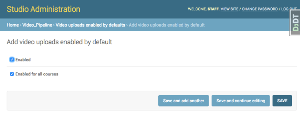
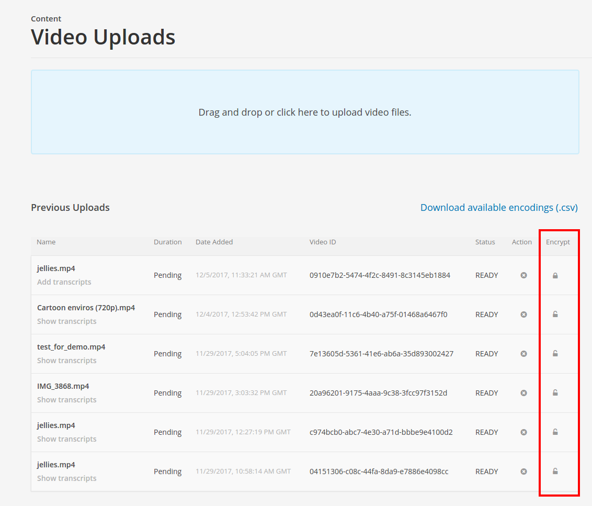

[](https://circleci.com/gh/raccoongang/azure-video-pipeline/tree/master)
[](https://codecov.io/gh/raccoongang/azure-video-pipeline)


# azure-video-pipeline
Provides ability to use MS Azure services as OpenEdx video upload, processing and delivery backend.

Azure Video Pipeline (AVP) is a Django application that aims to extend existent edx-platform course video upload functionality - adds ability to use Azure service as alter backend for video storage, processing (encoding, encrypting) and delivery (streaming, downloading).

Azure services that are involved:
- Azure Active Directory - API app authorization;
- Azure Blob Service - content storage;
- Azure Media Service - processing, delivery

AVP relies on the [edx-organizations](https://github.com/edx/edx-organizations) to make it possible to attach
Azure profile to certain Edx Organization, but global (installation-wide) settings also may be configured as
fallback.

# Configuration

The configuration process include two steps:
- OpenEdx platform configuration;
- Azure portal (dashboard) configuration.

## OpenEdx configuration

### Enabling Video Uploads

To enable video upload feature for Azure provide following settings:

a) in CMS configuration file `cms.env.json`

```
# cms.env.json

FEATURES: {
    ...
    "ENABLE_VIDEO_UPLOAD_PIPELINE": true,
}

"VIDEO_UPLOAD_PIPELINE": {
    "CLOUD": "azure"        # <-- it is "aws" as default alternative
},
```

b) via CMS admin site follow the URL: `/admin/video_pipeline/videouploadsenabledbydefault/` and
create/change `video-uploads-enabled-by-default` configuration:



> NOTE: Video Uploads page can be configured per course basis (by `course id`) or enabled for all courses.

Now the extra Content menu item `Video Uploads` (and video uploads page accordingly) should be available.


### Attaching Azure account to Organization

`Azure organization profile` contains all needed information to make it possible to:
- upload videos and transcripts to Azure;
- encode uploaded video (make a bulk of video files 'with different quality' - aka `bitrate ladder`);
- encrypt encoded video (optional);
- stream encoded \[encrypted\] video to be consumed by Azure Media Player;

Azure configuration may be performed in two ways:

1) globally (per instance installation) via `cms.auth.json` config file;

```
# cms.auth.json - please, see next screenshot below for values examples

...
'AZURE_CLIENT_ID': <replace-with-actual-value>,
'AZURE_CLIENT_SECRET': <replace-with-actual-value>,
'AZURE_TENANT': <replace-with-actual-value>,
'AZURE_REST_API_ENDPOINT': <replace-with-actual-value>,
'AZURE_STORAGE_ACCOUNT_NAME': <replace-with-actual-value>,
'AZURE_STORAGE_KEY': <replace-with-actual-value>,
...
```

2) organization wide - via CMS admin site.

In order to configure Azure backend for Organization one should create AzureOrgProfile within Studio (aka CMS) admin site: `admin/azure_video_pipeline/azureorgprofile/`

> NOTE: migration should be performed in order to make available `azure-video-pipeline` application's AzureOrgProfile model.

Please, refer to fields' informative help text.


## Azure configuration

### AD (Active Directory)

To be able to communicate with Azure services AD application (with `Web app / API` type) must be created and configured which ID and key secret are used in AzureOrgProfile as `Client ID` and `Client secret` respectively.
Data for `Tenant` setting may be found in AD/Properties/Directory ID.

### Blob service

Storage account must be created and configured. Account name and key are used in AzureOrgProfile
as `Storage account name` and `Storage key` respectively.

#### CORS

`CORS` should be configured to allow: OPTIONS, HEAD, GET, POST, PUT for all origins.

### Media service

Media service account must be created and configured.
Streaming endpoint should be in `running` status (it is stopped by default).
API access utilises `service principal` type.

# Usage

## Video content protection

After video file is uploaded to Azure service via Video Uploads page it can be protected.
To protect certain video from the list one may click 'lock' icon in `Encrypt` column (icon changes to `locked` state):



In order to `unlock` already protected video click 'lock' icon again.

> NOTE: Ideally, a decision about Video protection should be made right after its uploading.
Due to the way how dynamic encryption works all video's usages (via xblock) in the course
will become broken if lock enabled afterward.
Those videos may be picked up again with new manifests published.

Currently, the `AES-128 clear key` protection type is supported.
For more information about content protection, please, refer to the [Azure Media Services documentation](https://docs.microsoft.com/en-us/azure/media-services/media-services-content-protection-overview)
